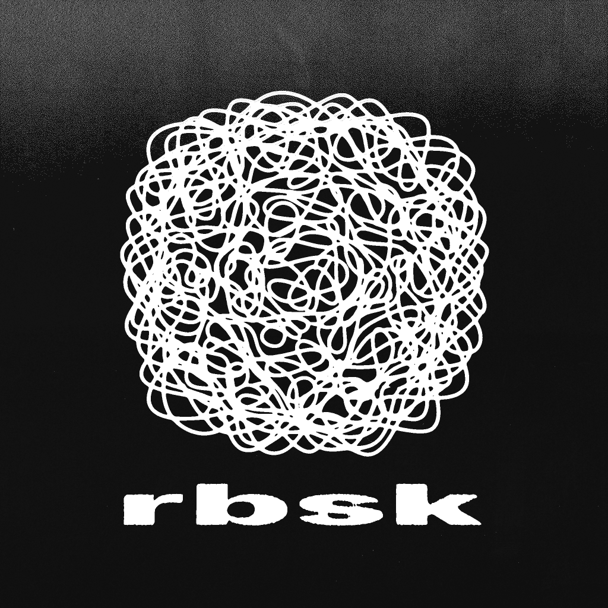

# rbsk Turbulent Displace

<div align="center">
  
  
  <h3>🌪️ ScriptUI Panel para After Effects</h3>
  <p>Aplicação intuitiva e eficiente do efeito Turbulent Displace com presets otimizados e controles dinâmicos</p>

  [](https://www.adobe.com/products/aftereffects.html)
  [](https://adobe.io/)
  [](https://extendscript.docsforadobe.dev/)
  [](LICENSE)
  [](https://github.com/rbsk/turbulent-displace/releases)

  [📥 Download](#-instalação) •
  [📖 Documentação](#-como-usar) •
  [🎨 Presets](#-presets-inclusos) •
  [🐛 Report Bug](https://github.com/rbsk/turbulent-displace/issues) •
  [💡 Request Feature](https://github.com/rbsk/turbulent-displace/issues)
</div>

---

## 📋 Índice

- [📦 Sobre o Projeto](#-sobre-o-projeto)
- [✨ Recursos](#-recursos)
- [🚀 Instalação](#-instalação)
- [📖 Como Usar](#-como-usar)
- [🎨 Presets Inclusos](#-presets-inclusos)
- [⚙️ Parâmetros](#️-parâmetros)
- [🔧 Solução de Problemas](#-solução-de-problemas)
- [🤝 Contribuição](#-contribuição)
- [📝 Licença](#-licença)
- [👤 Contato](#-contato)

---

## 📦 Sobre o Projeto

O **rbsk Turbulent Displace** é um painel ScriptUI profissional para Adobe After Effects que simplifica drasticamente a aplicação do efeito Turbulent Displace. Desenvolvido para artistas motion graphics e editores de vídeo, oferece controles intuitivos, presets otimizados e automação inteligente de keyframes.

### 🎯 Por que usar este script?

- **⚡ Velocidade**: Aplicação instantânea com um clique
- **🎨 Presets Profissionais**: Rabisco, Wiggle e Glitch pré-configurados
- **🔄 Animação Automática**: Posterize Time e expressões configuradas automaticamente
- **🎲 Aleatoriedade**: Geração de valores aleatórios para experimentação criativa
- **📱 Interface Responsiva**: Painel dockável com redimensionamento dinâmico

---

## ✨ Recursos

### 🔥 Principais Funcionalidades

- **🖥️ Painel Dockável**: Interface integrada ao After Effects
- **🎛️ Controles Dinâmicos**: Sliders e campos de texto sincronizados
- **🎨 3 Presets Premium**:
  - 📝 **Rabisco**: Efeito de desenho à mão
  - 🌊 **Wiggle**: Movimento orgânico suave
  - ⚡ **Glitch**: Distorção digital moderna
- **🎲 Modo Aleatório**: Geração automática de configurações criativas
- **⏱️ Animação Inteligente**: Posterize Time configurável (4-20 fps)
- **🔧 9 Tipos de Displacement**: Turbulent, Bulge, Twist e mais
- **👥 Múltiplas Camadas**: Aplicação em batch para workflow eficiente

### 🛡️ Recursos de Segurança

- ✅ **Validação Inteligente**: Verificação automática de valores
- 🔄 **Detecção de Conflitos**: Aviso para efeitos existentes
- 📝 **Sistema de Logs**: Debug mode para troubleshooting
- 💾 **Operações Seguras**: Undo group para reversão completa

---

## 🚀 Instalação

### 📋 Requisitos

- **Adobe After Effects**: CC 2018 ou superior
- **Sistema Operacional**: Windows 7+ ou macOS 10.12+
- **Espaço em Disco**: 2 MB

### 💻 Instalação Automática (Recomendada)

1. **📥 Download** do projeto:
   ```bash
   git clone https://github.com/rbsk/turbulent-displace.git
   ```
   
2. **🗂️ Execute** o instalador automático:
   ```bash
   # Windows
   instalar.bat
   ```

3. **🔄 Reinicie** o After Effects

4. **📂 Acesse** via: `Window > rbsk Turbulent Displace`

### 🔧 Instalação Manual

1. **📁 Localize** a pasta ScriptUI Panels:
   ```
   # Windows
   %USERPROFILE%\AppData\Roaming\Adobe\After Effects\[VERSION]\ScriptUI Panels\
   
   # macOS
   ~/Library/Preferences/Adobe/After Effects/[VERSION]/ScriptUI Panels/
   ```

2. **📋 Copie** os arquivos:
   - `rbsk.jsx`
   - `media/logo.png`

3. **🔄 Reinicie** o After Effects

---

## 📖 Como Usar

### 🎬 Início Rápido

1. **▶️ Abra** uma composição no After Effects
2. **🎯 Selecione** uma ou mais camadas
3. **🖱️ Abra** o painel: `Window > rbsk Turbulent Displace`
4. **🎨 Escolha** um preset ou configure manualmente
5. **✅ Clique** em "Aplicar Efeito"

### 🎛️ Interface do Painel

```
┌─────────────────────────────────┐
│  🏷️ rbsk Logo                    │
├─────────────────────────────────┤
│  ⚙️ Configurações do Efeito     │
│  • Tipo de Displacement  [▼]   │
│  • Quantidade: [━━━━━━] [50]    │
│  • Tamanho:    [━━━━━━] [100]   │
│  • Efeito de Rabisco: [━] [2]  │
├─────────────────────────────────┤
│  🎨 Presets                     │
│  [Rabisco] [Wiggle] [Glitch]   │
├─────────────────────────────────┤
│  📱 Opções                      │
│  ☑️ Aplicar Animação            │
│  • Posterize Time: [8] fps     │
│  ☑️ Aplicar em todas as camadas │
├─────────────────────────────────┤
│       [Aplicar Efeito] 🎲       │
└─────────────────────────────────┘
```

### 🎯 Fluxo de Trabalho Recomendado

1. **🎨 Experimente** com presets para encontrar o estilo desejado
2. **🎲 Use** o botão aleatório para descobrir configurações únicas
3. **🔧 Ajuste** parâmetros manualmente para refinamento
4. **⏱️ Configure** animação conforme necessário
5. **✅ Aplique** em múltiplas camadas para consistency

---

## 🎨 Presets Inclusos

### 📝 Rabisco
```javascript
Quantidade: 25
Tamanho: 15
Complexidade: 10
Tipo: Turbulent
Animação: 8 fps
```
*Perfeito para simulação de desenho à mão livre e anotações orgânicas*

### 🌊 Wiggle
```javascript
Quantidade: 15
Tamanho: 35
Complexidade: 1
Tipo: Turbulent
Animação: 8 fps
```
*Ideal para movimento sutil e orgânico, breathing effects*

### ⚡ Glitch
```javascript
Quantidade: 150
Tamanho: 3
Complexidade: 10
Tipo: Horizontal Displacement
Animação: 12 fps
```
*Efeito de glitch moderno para projetos cyberpunk e tech*

---

## ⚙️ Parâmetros

### 🎛️ Controles Principais

| Parâmetro | Range | Descrição |
|-----------|-------|-----------|
| **Quantidade** | 0-200 | Intensidade do deslocamento |
| **Tamanho** | 1-500 | Escala do padrão de turbulência |
| **Efeito de Rabisco** | 1-10 | Complexidade do padrão |
| **Posterize Time** | 1-60 fps | Frequência de atualização da animação |

### 🔄 Tipos de Displacement

1. **Turbulent** - Distorção orgânica padrão
2. **Bulge** - Efeito de protuberância 
3. **Twist** - Rotação e torção
4. **Turbulent Smoother** - Versão suavizada
5. **Bulge Smoother** - Bulge com transições suaves
6. **Twist Smoother** - Twist com suavização
7. **Vertical Displacement** - Apenas deslocamento vertical
8. **Horizontal Displacement** - Apenas deslocamento horizontal
9. **Cross Displacement** - Padrão cruzado complexo

---

## 🔧 Solução de Problemas

### ❓ Problemas Comuns

#### 🚫 Painel não aparece no menu Window
**Solução:**
1. Verifique se os arquivos estão na pasta correta
2. Reinicie completamente o After Effects
3. Execute como administrador (Windows)

#### ⚠️ "After Effects não está disponível"
**Solução:**
1. Certifique-se de ter um projeto aberto
2. Verifique se há composições no projeto
3. Reinicie o After Effects

#### 🎯 "Selecione pelo menos uma camada"
**Solução:**
1. Selecione uma ou mais camadas na timeline
2. Certifique-se de que as camadas não estão bloqueadas
3. Verifique se a composição está ativa

#### 🔄 Efeito não anima
**Solução:**
1. Verifique se "Aplicar Animação" está marcado
2. Confirme o valor do Posterize Time
3. Teste com valores de Posterize entre 8-12 fps

### 🛠️ Debug Mode

Para ativação do modo debug:
```javascript
// No início do script
var DEBUG_MODE = true;
```

### 📞 Suporte Adicional

- **📧 Email**: [seu-email@example.com]
- **🐛 Issues**: [GitHub Issues](https://github.com/rbsk/turbulent-displace/issues)
- **💬 Discussões**: [GitHub Discussions](https://github.com/rbsk/turbulent-displace/discussions)

---

## 🤝 Contribuição

Contribuições são sempre bem-vindas! Este projeto é mantido pela comunidade.

### 🔄 Como Contribuir

1. **🍴 Fork** o projeto
2. **🌿 Crie** sua feature branch:
   ```bash
   git checkout -b feature/AmazingFeature
   ```
3. **💾 Commit** suas mudanças:
   ```bash
   git commit -m 'Add some AmazingFeature'
   ```
4. **⬆️ Push** para a branch:
   ```bash
   git push origin feature/AmazingFeature
   ```
5. **🔀 Abra** um Pull Request

### 📋 Guidelines

- 📝 Siga as convenções de código existentes
- 🧪 Teste em múltiplas versões do After Effects
- 📖 Documente novas funcionalidades
- 🏷️ Use semantic versioning para releases

### 🎯 Áreas para Contribuição

- 🎨 Novos presets criativos
- 🌍 Traduções para outros idiomas
- 🐛 Correções de bugs
- ⚡ Otimizações de performance
- 📖 Melhorias na documentação

---

## 📝 Licença

Distribuído sob a licença MIT. Veja [LICENSE](LICENSE) para mais informações.

```
MIT License

Copyright (c) 2025 rbsk

Permission is hereby granted, free of charge, to any person obtaining a copy
of this software and associated documentation files (the "Software"), to deal
in the Software without restriction, including without limitation the rights
to use, copy, modify, merge, publish, distribute, sublicense, and/or sell
copies of the Software, and to permit persons to whom the Software is
furnished to do so, subject to the following conditions:

The above copyright notice and this permission notice shall be included in all
copies or substantial portions of the Software.
```

---

## 👤 Contato

**rbsk** - Desenvolvedor Principal

- 🌐 **Website**: [rbsk.dev](https://rbsk.dev)
- 📧 **Email**: contato@rbsk.dev
- 🐙 **GitHub**: [@rbsk](https://github.com/rbsk)
- 🐦 **Twitter**: [@rbsk_dev](https://twitter.com/rbsk_dev)

**Link do Projeto**: [https://github.com/rbsk/turbulent-displace](https://github.com/rbsk/turbulent-displace)

---

## 🙏 Agradecimentos

- [Adobe After Effects](https://www.adobe.com/products/aftereffects.html) - Platform base
- [ExtendScript Toolkit](https://extendscript.docsforadobe.dev/) - Ferramentas de desenvolvimento
- [ScriptUI Guide](https://extendscript.docsforadobe.dev/user-interface-tools/scriptui/) - Documentação de interface
- [After Effects Scripting Guide](https://ae-scripting.docsforadobe.dev/) - Referência da API
- [aescripts + aeplugins](https://aescripts.com/) - Inspiração da comunidade
- Contribuidores e beta testers da comunidade

---

<div align="center">
  
  ### ⭐ Se este projeto ajudou você, considere dar uma estrela!
  
  [](https://github.com/rbsk/turbulent-displace/stargazers)
  [](https://github.com/rbsk/turbulent-displace/network)
  [](https://github.com/rbsk/turbulent-displace/watchers)

  **Desenvolvido com ❤️ por rbsk**
  
  [⬆️ Voltar ao topo](#rbsk-turbulent-displace)
  
</div>